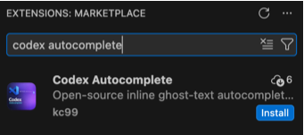
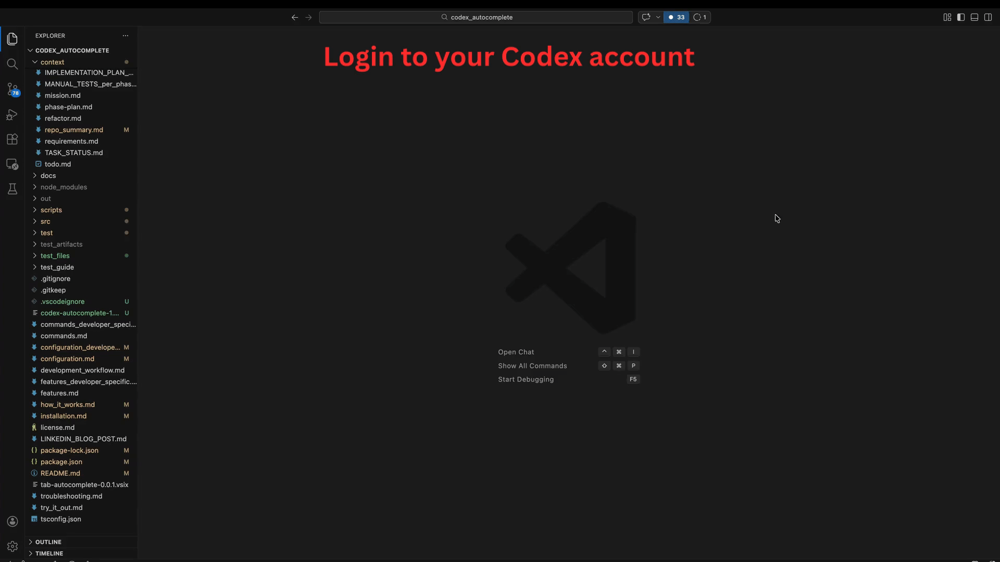
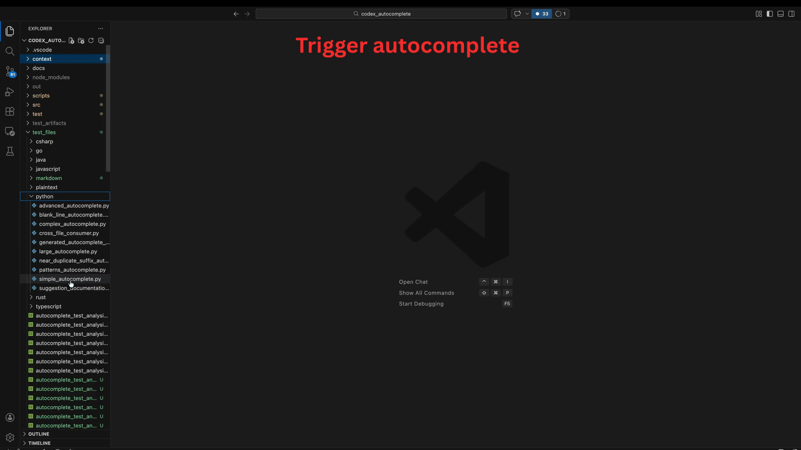

# Codex Autocomplete

Codex Autocomplete is a free, open-source Visual Studio Code extension that brings Cursor-style inline “ghost text” completions to VS Code using **Codex OAuth**.

Sign in with your **Codex account** to get AI-powered suggestions directly in the editor as you type. The extension is designed for fast, reliable inline completions, with clear controls for authentication, request behavior, latency, and overall reliability.

By using OAuth, teams can access Codex through their existing plan limits or credits instead of relying on separate pay-as-you-go API calls for every completion.

Because the project is open source, anyone can inspect the code, customize it for their workflow, and contribute improvements.

> Currently, only **macOS** is supported. Windows support may be added in the future if there is enough demand.

> [!WARNING] This is **not an official OpenAI extension**.

## Why use Codex Autocomplete?

Codex Autocomplete is built for developers who want Codex-powered inline suggestions directly inside VS Code.

It is especially useful if you:

- Already use Codex and want in-editor ghost text while coding manually
- Want to use your existing plan limits or credits instead of separate pay-as-you-go API charges for each completion
- Want inline suggestions while writing code, Markdown, documentation, and plain text
- Want support for both full-line suggestions and partial-line completions
- Want more predictable suggestion behavior, with controls for trigger mode, latency, and request limits
- Want an open-source extension your team can review, customize, and extend

## Highlights

- **Codex OAuth login** - Sign in with your existing Codex account
- **Inline ghost text completions** - Get suggestions directly in VS Code as you type
- **Full-line and partial-line completion** - Works across different coding and writing flows
- **Configurable behavior** - Tune trigger mode, latency handling, and request limits
- **Open source** - Review the implementation, adapt it to your needs, and contribute improvements

 

 

## Get Started

Three easy steps to get started:

1) Install and verify the extension installation

    Open Visual Studio Code

    **Install the extension**
    
    Via extension marketplace

    - Open Extensions panel (`Cmd+Shift+X`) 
    - Search for 'codex Autocomplete'
    - Click on install

 

 
 
2) Login to your Codex account
    - Open the Command Palette with (`Cmd/Ctrl+Shift+P`)
    - Run `Codex Autocomplete: Login`
    - Confirm login succeeded (notification: `Codex Autocomplete: logged in.`).
 

 

3) Trigger autocomplete

    - Open any code, markdown, or text file
    - Click on a line in the code
    - Press `Ctrl+Alt+Space` (`Ctrl+Option+Space` on macOS) to trigger inline ghost text
    Note: `Option+Tab` is also available, but `Ctrl+Alt+Space` is the more reliable shortcut to remember across environments
    - Tab to accept the suggestion

    Alternatively, use the [try it out guide](try_it_out.md) to try with an example code file. 

 

 

## Installation

For more detailed setup instructions see [installation.md](installation.md).

## Core features

- **Inline ghost-text autocomplete** in the editor, with Tab to accept suggestions
- **Returns full lines and completes partial lines of code**, so suggestions can either finish the line you are on or continue into the next likely lines
- **Support for code, markdown, and text files**
- **OAuth login flow** with secure token storage in VS Code `SecretStorage`
- **Flexible triggering modes** with `hotkey` as the default and optional `automatic` mode
- **Configurable behavior** for completion rules, model and endpoint selection, context sizing, latency budgets, and rate limits

## Developer/Maintainer features

The repository includes optional developer/maintainer workflows for debugging and validation:

- Built-in debug/testing workflows for bulk quality checks and response-time tracking
- Runtime-aligned benchmark CLIs that follow the hotkey-to-ghost-text pipeline by default
- Request/response observability with full request payload logs (redacted), full SSE stream logs, reconstructed response logging, and structured request summaries

For a more detailed feature breakdown, see [features.md](features.md).
For a high-level architecture and request-flow walkthrough, see [how_it_works.md](how_it_works.md).

## Commands

Use this when running extension commands from the Command Palette and reviewing their outputs/artifacts.
Commands and command-output instructions are in [commands.md](commands.md).

## Configuration

Use this to tune extension behavior, including completion rules, triggering, latency, context, endpoint and model settings, and logging.

Configuration instructions are in [configuration.md](configuration.md).

## How keys and tokens are stored

This extension does **not** require you to manage raw API keys in project files or environment variables for normal use.

- OAuth access and refresh tokens are stored in VS Code's encrypted `SecretStorage`
- Secrets are scoped to your local VS Code profile and managed through the extension's auth commands
- The repository does not persist your personal tokens in source-controlled files

## Troubleshooting

Troubleshooting instructions are in [troubleshooting.md](troubleshooting.md).

## Development workflow

If you want to modify the code, use this for day-to-day contributor flow: build, run, test, and iterate locally.
Development workflow instructions are in [development_workflow.md](development_workflow.md).

## Repository structure

If you want a quick map of the top-level folders and what each one is for, see [repository_structure.md](repository_structure.md).
