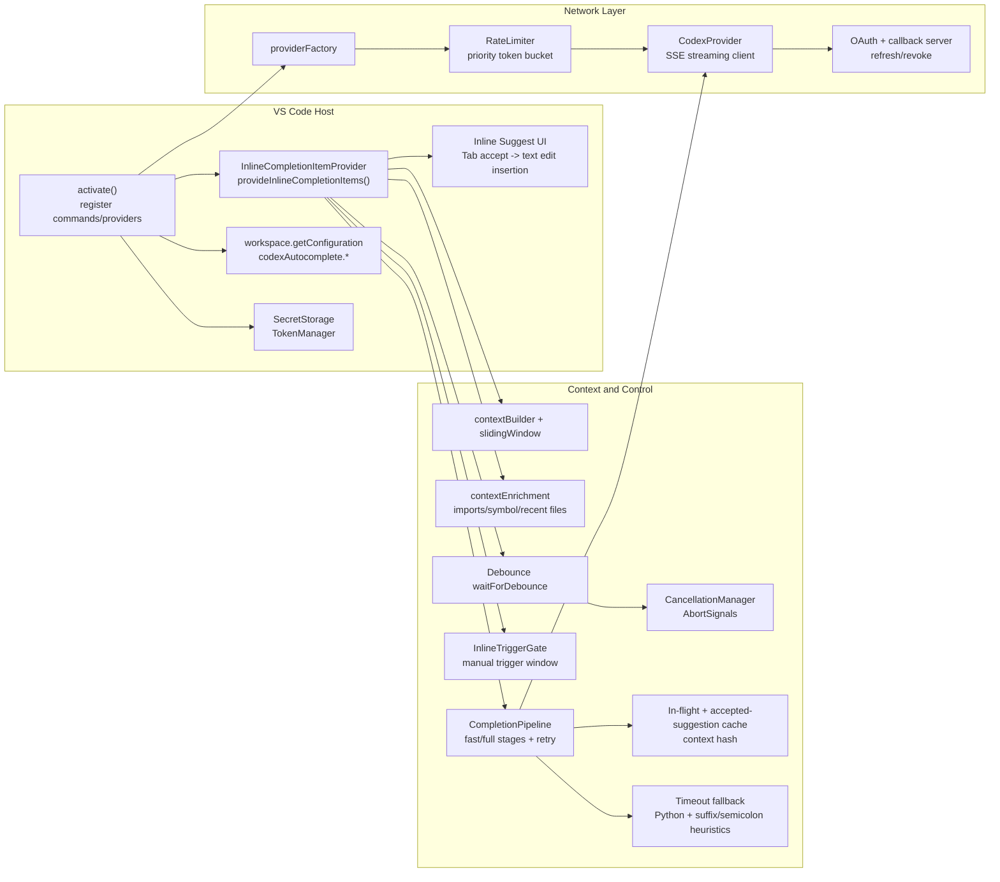

# How It Works

This document explains, at a high level, how Codex Autocomplete produces inline suggestions in VS Code.

## High-Level Flow

1. You type in an editor.
2. The extension checks whether it should generate a suggestion right now.
3. It gathers the code around your cursor to understand the local context.
4. It asks the model for a completion, sometimes starting with a faster lightweight request and then falling back to a fuller one if needed.
5. As text streams back, the extension cleans it up so it fits naturally at the cursor.
6. If nothing useful comes back, the extension may skip showing a suggestion.
7. When the same context appears again, recent results can sometimes be reused to respond faster.

## Configuration Cross-Reference

Use [configuration.md](configuration.md) to tune the behaviors described in this document.

- Trigger behavior: `codexAutocomplete.enabled`, `codexAutocomplete.triggerMode`
- Endpoint/model/prompt behavior: `codexAutocomplete.endpoint`, `codexAutocomplete.endpointMode`, `codexAutocomplete.model`, `codexAutocomplete.completionConstraintLines`
- Context sizing: `codexAutocomplete.maxContextLines`, `codexAutocomplete.maxFileLines`
- Latency and reliability: `codexAutocomplete.debounceMs`, `codexAutocomplete.firstChunkMaxLatencyMs`, `codexAutocomplete.maxLatencyMs`, `codexAutocomplete.rateLimitWindowSec`, `codexAutocomplete.rateLimitMaxRequests`
- Output and API-specific knobs: `codexAutocomplete.maxOutputTokens`, `codexAutocomplete.serviceTier`, `codexAutocomplete.promptCacheKey`, `codexAutocomplete.promptCacheRetention`
- Diagnostics: `codexAutocomplete.logLevel`

## High-Level Architecture

## Main Components

- `src/extension.ts`: registers commands and initializes the inline completion provider.
- `src/completion/inlineProvider.ts`: orchestrates trigger handling, context capture, normalization, and inline result delivery.
- `src/completion/contextBuilder.ts`: builds cursor-local context and a deterministic context hash.
- `src/completion/completionPipeline.ts`: handles in-flight dedupe, accepted-suggestion cache reuse, two-stage completion, latency budgets, and hotkey semantic retry.
- `src/completion/ghostTextPostProcessor.ts`: applies shared normalization plus timeout/blank-result fallback repairs before ghost text is returned.
- `src/completion/stageRequestFactory.ts`: builds the fast-stage and full-stage requests.
- `src/completion/contextEnrichment.ts` and `src/completion/contextEnrichmentCore.ts`: build optional extra context (imports, current symbol, recent files), with a VS Code-free core reused by CLI benchmarks.
- `src/debug/hotkeyGhostTextFlow.ts`: reuses the staged hotkey-to-ghost-text flow for bulk/response CLI benchmarks so they follow the same fast/full path as the extension.
- `src/api/codexProvider.ts`: builds the structured inline payload, sends the Responses request, and parses SSE responses.

## Context, Prompt, And Codex Call Parameters

### Context built in the editor

The context object includes:

- `prefix` and `suffix`: text before/after cursor in the bounded window.
- `beforeLines` and `afterLines`: line-array form of the same window.
- `selection`, `languageId`, `filePath`, `cursor`, `truncated`.
- `hash`: stable fingerprint used for dedupe/cache/retrigger control.

That editor-local context is then turned into one of two request shapes:

- fast stage: trimmed nearby `prefix`/`suffix` only
- full stage: full bounded `prefix`/`suffix` plus optional enriched `context`

Context window sizing and skip behavior are controlled by `codexAutocomplete.maxContextLines` and `codexAutocomplete.maxFileLines` in [configuration.md](configuration.md).

### Prompt structure sent to Codex

`src/api/codexProvider.ts` now sends a compact JSON string built from an `inline_context_v1` payload, not the older plain-text sectioned prompt. The payload includes:

- `language`
- `cursor_context` (`line_prefix`, `line_suffix`, indent, token-before-cursor, call context)
- `ordered_context` (combined ranked before/after lines with signed `distance` and `side`)
- optional `extra_context` (imports/current symbol/recent files, truncated)

Separately, request instructions are sent through the Responses API `instructions` field. These are built from `codexAutocomplete.completionConstraintLines` plus inline-completion-specific guidance added by the extension. Request behavior is primarily controlled by `codexAutocomplete.model`, `codexAutocomplete.completionConstraintLines`, and `codexAutocomplete.maxOutputTokens` in [configuration.md](configuration.md).

### Codex call parameters used

The extension sends a Responses-style request body including:

- `model`
- `instructions` (extension/system instructions)
- `reasoning: { effort: "low" }`
- `stream: true`
- `store: false`
- `input` (single user message containing the built prompt text)

`Codex Autocomplete: Debug Context` exposes the same `fast_request_body` and `full_request_body` shapes that the provider logs as `[codex] request body`, alongside the decoded compact prompt payloads.

When using `https://api.openai.com/v1/responses`, it can also send:

- `max_output_tokens`
- `service_tier`
- `prompt_cache_key`
- `prompt_cache_retention`

Endpoint routing and API request knobs are configured with `codexAutocomplete.endpoint`, `codexAutocomplete.endpointMode`, `codexAutocomplete.serviceTier`, `codexAutocomplete.promptCacheKey`, and `codexAutocomplete.promptCacheRetention` in [configuration.md](configuration.md).

### Reliability and latency controls around the call

- Local rate limiting (`codexAutocomplete.rateLimitWindowSec`, `codexAutocomplete.rateLimitMaxRequests`)
- Debounce before request in automatic mode (`codexAutocomplete.debounceMs`)
- Trigger gating for `automatic` vs `hotkey` mode
- First-chunk and total-latency cancellation budgets
- Fast-stage then full-stage fallback under a shared latency budget
- Adaptive hotkey fast-stage skipping based on recent hit/fallback behavior
- Optional hotkey semantic retry when the first suggestion looks semantically off
- Retry on `429` with bounded exponential backoff + jitter
- In-flight dedupe, accepted-suggestion cache reuse, and completed-context suppression via context hash
- Language-aware timeout fallback for narrow no-first-chunk cases (Python repairs, unique identifier/member suffixes, and semicolon completion)

### Hotkey-to-ghost-text timers

There are several separate timers, and they apply at different layers:

1. Hotkey trigger admission
   - The hotkey command opens a manual-trigger window for `1200ms`.
   - In `hotkey` mode, only requests that arrive inside that window are treated as explicit hotkey requests and get the hotkey latency shaping below.
2. Hotkey UI timers
   - `Generating suggestion...` and `Auto-retrying...` notifications have their own `5000ms` UI timeout.
   - Empty-result retriggers and duplicate notices are suppressed for `1500ms` per editor/context, so one empty hotkey attempt only auto-retries once during that window.
   - These timers are presentation-only; they are separate from the model request budgets below and are not configurable through [configuration.md](configuration.md).
3. Request-level timers inside `CompletionPipeline.runCompletion()`
   - Every streamed model call gets a normalized stage budget with a total-latency deadline and a first-chunk deadline.
   - The base values come from `codexAutocomplete.maxLatencyMs` and `codexAutocomplete.firstChunkMaxLatencyMs` in [configuration.md](configuration.md), then the stage budget is normalized once so first chunk never exceeds total latency.
   - If stream progress arrives before any text, the first-chunk deadline can be extended by up to `1200ms` at a time, at most twice, but never past the total deadline.
   - If some suggestion text has already arrived and the request is within `80ms` of the total deadline, the pipeline returns the partial suggestion instead of waiting for more chunks.
4. Fast-stage vs full-stage timing
   - Two-stage requests start with a fast stage, then fall back to a full stage only if the fast stage returns empty or errors.
   - Normally, the full stage inherits only the remaining time from the shared request budget.
   - Explicit hotkey requests are special: if the fast stage times out before producing a first chunk, the full-stage budget is refunded and restarted instead of inheriting only the remaining time.
   - For non-refunded fallbacks after a first-chunk timeout, the full-stage first-chunk wait is capped at `1200ms`.
   - The fast-stage cap itself is an internal request-shaping value, not a setting currently documented in [configuration.md](configuration.md).
5. Shared inline latency shaping
   - Automatic and hotkey requests use the same extended staged budget profile.
   - The normalized request budget is: total latency at least `6000ms`, fast-stage max latency fixed at `2000ms`, and first-chunk max latency clamped into `1800-2200ms`.
   - Explicit hotkey requests still keep the extra manual-only behaviors above, such as the refunded full-stage reset after a fast-stage no-first-chunk timeout.
6. Semantic retry budget
   - Hotkey semantic retry is a separate follow-up request that only runs after a non-empty hotkey result looks semantically suspicious.
   - Its default budget is smaller than the main hotkey request: `1800ms` total and `220ms` for first chunk.
   - These semantic-retry timing values are currently internal inline-provider defaults; they are not listed in [configuration.md](configuration.md).

See [configuration.md](configuration.md) for the exact settings and defaults that control these limits.
