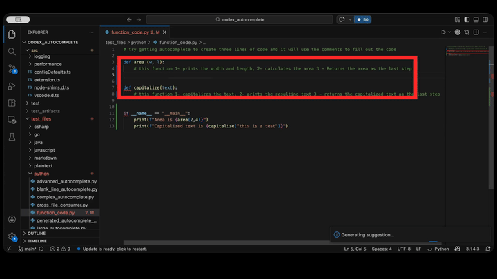

# Try It Out

Use this quick path to test autocomplete against comment-driven Python code generation.

## Prerequisite Steps

1. Open regular VS Code.
2. Open this file: `test_files/python/function_code.py`.
3. Run Command Palette (`Cmd/Ctrl+Shift+P`) -> `Codex Autocomplete: Login`.
4. Confirm login succeeded (notification: `Codex Autocomplete: logged in.`).

## Comment-Driven Autocomplete Example

In this example we will autocomplete code for a whole function using the comments as context.  
1. In `test_files/python/function_code.py`,
2. Place your cursor on the blank indented line under the comment inside `def area(w,l):` 
   * Trigger suggestion:
     - Press `Option+Tab` / `Ctrl+Option+Space` or Run `Codex Autocomplete: Debug Trigger Hotkey`, 
   * Press `Tab` to accept the first autocomplete result.
   * Repeat for 3 autocompletes
3. Place your cursor on the blank indented line under the comment inside `def capitalize(text):def area(w,l)`
   * Trigger suggestion:
     - Press `Option+Tab` / `Ctrl+Option+Space` or Run `Codex Autocomplete: Debug Trigger Hotkey`, 
   * Press `Tab` to accept the first autocomplete result.
   * Repeat for 3 autocompletes
4. Press save `Command+S`
5. Run python code
   * Open terminal : menu terminal > new terminal
   * Type `python test_files/python/function_code.py` and press enter
   * Review the results

</br>

</br>

## Expected Result

`test_files/python/function_code.py` should end up like this:

```python
# try getting autocomplete to create three lines of code and it will use the comments to fill out the code

def area(w,l):
    # this calculates the area, prints the width and length, prints the area.  Returns the area
    print(w, l)
    area = w * l
    return area
      
def capitalize(text):
    #this capitalizes the text, prints the resulting text and returns the capitalized text
    capitalized = text.capitalize()
    print(capitalized)
    return capitalized

if __name__ == "__main__":
    print(f"Area is {area(2,4)}")
    print(f"Capitalized text is {capitalize("this is a test")}")

```

Terminal results should be
```
Width: 2, Length: 4
Area is 8
This is a test
Capitalized text is This is a test
```

If no suggestion appears, run `Codex Autocomplete: Debug Token Check` to confirm auth.

## Logout (Optional After Testing)

1. Run Command Palette (`Cmd/Ctrl+Shift+P`) -> `Codex Autocomplete: Logout`.
2. Optional check: run `Codex Autocomplete: Debug Token Check` and confirm `Codex Autocomplete: not logged in.`.

For the full end-to-end validation flow, see [manual_end2end_test.md](test_guide/manual_end2end_test.md).
